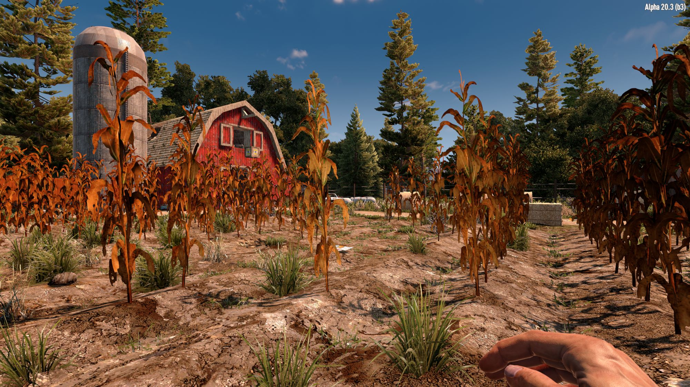
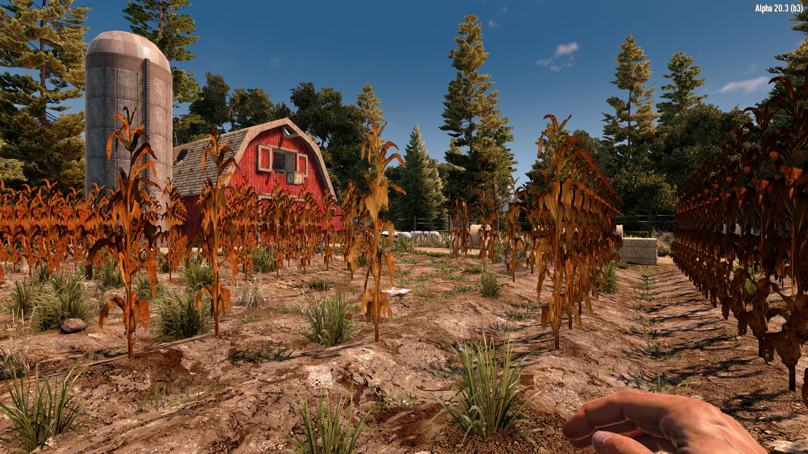

# OCB Better Plant Rendering Modlet - 7 Days to Die Addon

Augments how plants are rendered by adding some static randomness (tm).
This is most obvious when you have a row of the same plant (e.g. corn).
It get visually very obvious that they are all exactly rendered the same.

Compare the following two screenshots (first ON, second OFF)

NOTE: This MOD uses [BepInEx][1] to pre-patch the game dll. This is a pretty
new way to dynamically patch the game dll without providing a patched dll.
When you start the game for the first with this mod installed, the console
should pop up (or hit F1) and a message should be shown that you need to
*restart the game once* for the newly added files to take effect.
Also make sure that you have *EAC disabled*.

[![GitHub CI Compile Status][3]][2]

## Quick-Start Guide

- Install into `Mods/` directory (e.g. `Mods/OcbBetterPlants/ModInfo.xml`)
- Make sure you don't have nested folders (see structure above)
- Make sure that you have *EAC disabled* (google is your friend)
- Start the game and wait for the console to open (or hit F1)
- You should see a message (look-out for yellow/red texts)
- Restart the game for changes to take effect
- Optional: Check console (all warnings gone?)

### Static Randomness Explained

Basically we add some random scaling and rotation to each plant, but the
devil is in the details. We can't just use a random number generator.
Certain actions, like harvesting corn crops, triggers other plants to
be re-rendered, thus getting a completely new random value. To solve
this I "crafted" a static random number generator. It basically convert
the plant's position to a random number, e.g. different positions give
varying results even for small changes. Adding a random seed (initialized
on game startup), we can easily create multiple random values per position.
These stay always the same for the same position and neighbors get a very
different random number, leading to more visual variation in your garden.

## Changelog

### Version 0.1.0

- Initial version

## Compatibility

I've developed and tested this Mod against version a20.3b3.

[1]: https://github.com/OCB7D2D/A20BepInExPreloader
[2]: https://github.com/OCB7D2D/OcbBetterPlants/actions/workflows/ci.yml
[3]: https://github.com/OCB7D2D/OcbBetterPlants/actions/workflows/ci.yml/badge.svg